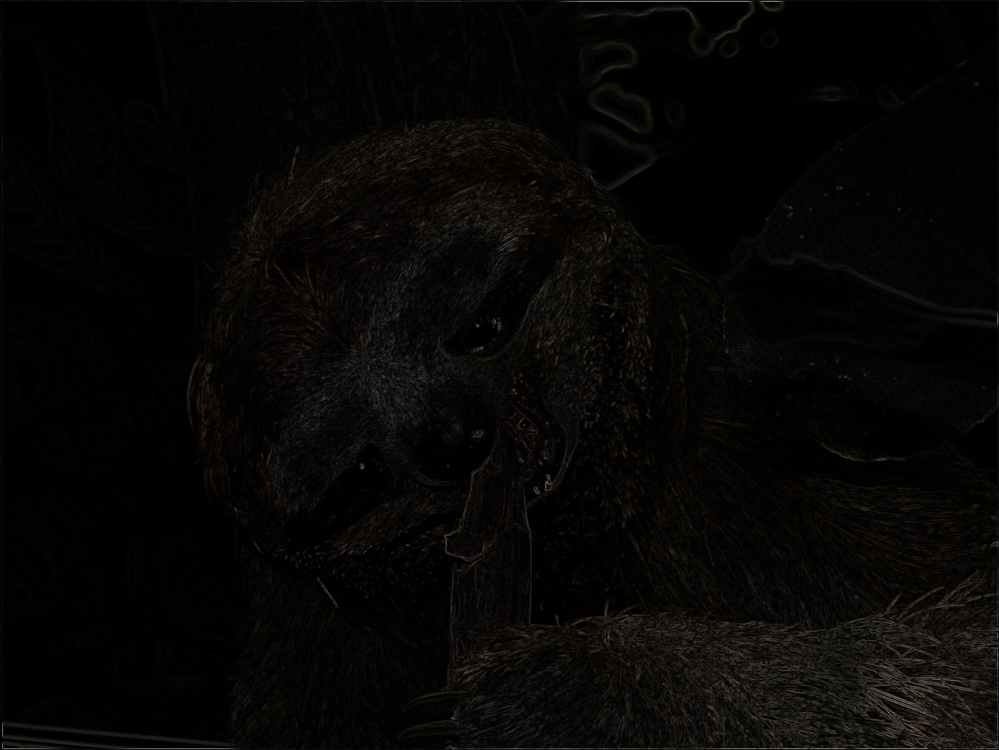

# Edge Detection using NVIDIA CUDA kernels and CuDNN

This project is based on my submission for the [coursera cuda at scale](https://github.com/alex-n-braun/coursera_cuda_at_scale) project.

| edges| generated from |
|-|-|
|  |  |
|||

Current performance measurement:
Elapsed time in nanoseconds:
|                       | Total         | per frame |
|-|-|-|
| incl. io              | 10675647389   | 42532459  |
| excl. io              | 9140242967    | 36415310  |
| gpu                   | 8443221916    | 33638334  |
| w/o conv. to int      | 8401399737    | 33471712  |

Reduce gpu mem alloc / dealloc by removing this step from the frame processing. This yields an 
improvement in runtime of roughly 5% for the pure computation on the gpu without float<=>int conversions.

Elapsed time in nanoseconds:
|                       | Total         | per frame |
|-|-|-|
| incl. io              | 9823949656    | 39139241  |
| excl. io              | 8311901920    | 33115147  |
| gpu                   | 7938228023    | 31626406  |
| w/o conv. to int      | 7930628447    | 31596129  |

Now, creation and destruction of cudnn handles and tensor descriptors and the like is taken out of the frame processing. 
Instead, these handles are now stored outside of the relevant methods. **This yields an additional improvement
in frame-processing runtime of roughly 81%** (wow!).

Elapsed time in nanoseconds:
|                       | Total         | per frame
|-|-|-|
| incl. io              | 5260741121    | 20959127
| excl. io              | 2015754933    | 8030896
| gpu                   | 1509760936    | 6014983
| w/o conv. to int      | 1488816208    | 5931538

So, only creating cudnn handles when needed really pays off. One might want to further investigate the difference of the cudnnHandle_t and other objects like cudnnTensorDescriptor_t and so forth.

It is possible to further reduce operations that are potentially redundant, such as repeatedly setting image width and height although this should be constants for a video clip. Further runtime improvement of roughly 2-3%.

Elapsed time in nanoseconds:
|                        | Total         |  per frame
|-|-|-| 
| incl. io               | 4944791394    |  19700364
| excl. io               | 1908645536    |  7604165
| **gpu**                | **1460924323**|  **5820415**
| w/o conv. to int       | 1448427256    |  5770626

Final step for transforming the GPU part: all relevant operations are added to a CUDA *graph*, which is then replayed once per frame during the video processing. This leads to a further runtime 
improvement of roughly 4-5%. Note that it is now not possible anymore to discriminate between single steps that run inside the graph (like excluding type casts as in the performance measurement above), since this would make it necessary to add performance measurements *inside* the graph (which I don't know (yet) how that works). The graph *including* the type casts is faster than the previous imperative implementation anyways.

Elapsed time in nanoseconds:
|                        | Total       |  per frame
|-|-|-|
| incl. io               | 4778412190  |  19037498
| excl. io               | 1795590019  |  7153745
| **gpu**                | **1391767538**|  **5544890**

There is much more that could be optimized:
* use of pinned memory
* potentially use of asynchronous operation
* inclusion of mem copy operations into the cuda graph
* ...

However, since I already have spent quite some time with this project, I will stop here.

Explanation of this measurements will follow in upcoming PRs.

From here, the README is outdated and needs to be rewritten.

You can also find a demo-video [here](https://youtu.be/jUtQt9ZvPe0), with the input-video [here](https://youtu.be/tQldJe16lGg).

## Overview

This project demonstrates the use of NVIDIA Performance Primitives (NPP) library with CUDA to perform edge detection. The goal is to utilize GPU acceleration to efficiently find edges in a given image by using a sobel operator. The project is a part of the CUDA at Scale for the Enterprise course from coursera. It is based on the [image rotation project](https://github.com/PascaleCourseraCourses/CUDAatScaleForTheEnterpriseCourseProjectTemplate).

## Code Organization

```bin/```
After building using make, this folder will hold the executable `edgeDetection`.

```data/```
This folder holds example data, an image [`Lena.png`](./data/Lena.png). By default, the output is stored in the same folder.

```src/```
Holds the source code of the project

```README.md```
This file describes the project. It holds human-readable instructions for building and executing the code.

```Makefile```
This file contains the instructions for building the project using the make utility. It specifies the dependencies, compilation flags, and the target executable to be generated.

## Key Concepts

The application performs multiple steps:
1. Loading the data from disk (either image, or video)
2. Manipulate image or single frames from the video
3. Store manipulated data back to disk, either as an image, or as a video file.

The image processing makes use of several NPP functions:
1. Convert RGB image to grayscale `nppiRGBToGray_8u_AC4C1R`
2. Apply a sobel operator to detect edges: `nppiFilter32f_8u16s_C1R` to compute a convolution, 
`nppiAbs_16s_C1R` to compute the absolute value (only keep positive values for the edges), and 
`nppiConvert_16s8u_C1R` for converting back to 8 bit grayscale. This step is repeated two times,
for horizontal edges, as well as for vertical edges, by providing two different kernels.
3. Combine the horizontal and vertical edges into a single grayscale image, simply by bitwise or
`nppiOr_8u_C1R`
4. Finally multiplying the grayscale edges image with the original RGB image, to colorize the edges.
To do that, first broadcast the grayscale image into an RGB image (`nppiCopy_8u_C1C4R`, `nppiSet_8u_C4CR`), 
and finally multiply both (`nppiMul_8u_C4RSfs`).

## Supported OSes

The project was testet on Ubuntu 24.04. 

## Supported CPU Architecture

The project was tested on x86_64.

## CUDA APIs involved

NVIDIA Performance Primitives (NPP)

## Dependencies needed to build/run
* [FreeImage](https://freeimage.sourceforge.io/) On Ubuntu, `apt install libfreeimage-dev` 
* [NPP](https://developer.nvidia.com/npp) Need to [install NVidia CUDA Toolkit](https://docs.nvidia.com/cuda/cuda-installation-guide-linux/index.html)
* [opencv](https://opencv.org/) `apt install libopencv-dev`
* [cuda-samples](https://github.com/NVIDIA/cuda-samples) You need to adapt the [`Makefile`](./Makefile) accordingly

## Prerequisites

Download and install the [CUDA Toolkit](https://developer.nvidia.com/cuda-downloads) for your corresponding platform. The project was tested with CUDA 11.8 and 12.5. 
Make sure the dependencies mentioned in [Dependencies]() section above are installed.

## Build and Run

The project has been tested on Ubuntu 24.04. There is a [`Makefile`](./Makefile), therefore the project can be built using
```
$ make
```

## Running the Program
You can run the program using the following command:

```bash
make run
```

This command will execute the compiled binary, applying the edge filter on the example input image (Lena.png), and save the result as Lena_edge.png in the data/ directory.

If you wish to run the binary directly with custom input/output files, you can use:

```bash
./bin/edgeDetection --input data/Lena.png --output data/Lena_edges.png
```

You can also process a video file. The i/o is implemented using opencv:

```bash
./bin/edgeDetection --input some_input.mp4 --output edges_video.mp4
```

- Cleaning Up
To clean up the compiled binaries and other generated files, run:


```bash
make clean
```

This will remove all files in the bin/ directory.
